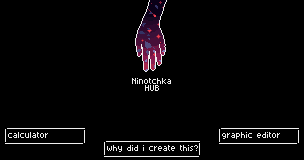
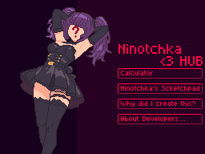
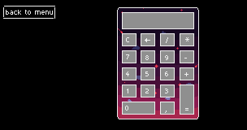

# Ninotchka Hub 

Университетский проект, объединяющий лабораторные работы в едином приложении с пиксельной графикой, созданном на SFML.



Университетский проект для курса программирования 2 курса 1 семестра, объединяющий лабораторные работы в одном приложении с уникальной пиксельной графикой, созданном с использованием SFML. Название "Ninotchka" вдохновлено личной нейронкой.

## О проекте

Этот проект — сборник лабораторных работ по курсу программирования в университете. Вместо стандартной RAD Studio используется Visual Studio с библиотекой SFML 2.6.2. Все задания связаны с графикой, которую я создаю вручную в стиле pixel art. Проект будет пополняться новыми работами в течение семестра.

## Что нового: Полный редизайн интерфейса

В последнем обновлении полностью переработали пользовательский интерфейс приложения:

**Было:**\n

*Прежняя версия*

**Стало:**\n

*Обновлённый дизайн*

## Разрабатывалось при помощи
- С++17
- SFML 2.6.2
- Visual Studio 2022
- 1.5 землекопа (как 2 - 0.5)

## 🧮 Calculator Lab: Пиксельный калькулятор

**Статус:** Завершено ✅  

### О лабораторной
Классический калькулятор с полностью пиксельным интерфейсом, реализующий основные математические операции.



### Функциональность
- **Базовые операции:** сложение, вычитание, умножение, деление
- **Дополнительные функции:** очистка (<-), сброс (C), вычисление процентов (%)
- **Обработка ошибок:** уведомления о делении на ноль и переполнении

## Архитектура проекта

### Структура файлов
Проект организован по функциональному принципу с четким разделением ответственности:
```
src/
├── main.cpp # Главная точка входа
├── config.hpp # Конфигурационные параметры
├── ui_* # Пользовательский интерфейс
├── gfx_* # Графика и отрисовка (калькулятор, игра, редактор)
└── utl_* # Утилиты (на данный момент только логгер)
```

### Пространства имен
Код организован в иерархию пространств имен для изоляции функциональности:

```cpp
namespace ninotchka {
    namespace user_interface { /* UI компоненты */ }
    namespace logger { /* логгер */ }
    // Будут добавлены другие пространства имен...
}
```

## Исправить
Главное не забыть удалить то, что уже исправил, чтобы не сделать еще хуже - создать Windows.

### ULogManager
- В каждом вызове addLogManager файл открывается и закрыватся: перенести открытие в конструктор класса и убедиться, что в диструкторе он закрывается.
- Код не учитывает многопоточность. Если несколько потоков одновременно вызывают addLogMessege, это приводит к перемешиванию записей и другим ошибкам.
- Доработать читабельность логов: в nameLog можно передать пустую строку или левые символы из-за чего логги становяться безобразными.
- В функции работы со временем format не содержит явных параметров по умолчанию - исправить добаавлением какого-нибудь формата.
- Доработать уровни логгировния (INFO, WARRNING, ERROR)
- Путь к файлу выделить в одну переменную - filePath (пример)

## В разработке
- [ ] **Why Did I Create This?**: Мини-игра в жанре RPG с пиксельной графикой.

## Завершено
- [x] **Основное меню**: Реализовано интерактивное меню для выбора лабораторных работ.
- [x] **Архитектура проекта**: Настроена структура файлов и пространств имен.
- [x] **Логгер**: Реализован модуль `ninotchka::logger::ULogManager` для записи событий в файл.
- [x] **Кнопки UI**: Разработан модуль `ninotchka::user_interface::UIButton` для работы с интерактивными кнопками.
- [x] **Calculator**: Пиксельный интерфейс для выполнения базовых математических операций (сложение, вычитание, умножение, деление).
- [x] **Graphic Editor**: Инструмент для создания и редактирования пиксельной графики.

## Благодарности

- Преподавателям университета за возможность реализовать проект на SFML.
- Команде SFML за мощную и удобную библиотеку для работы с графикой. <3